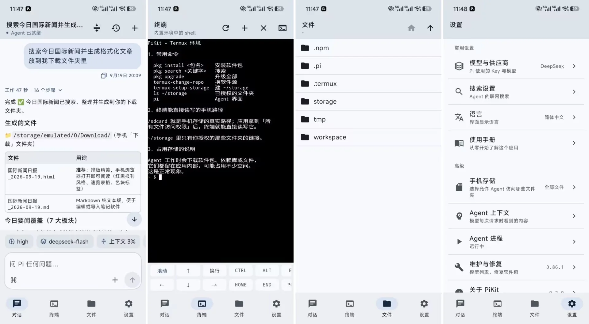

<p align="center">
  
</p>

<h1 align="center">PiKit</h1>

<p align="center"><strong>一个基于 pi 和 Termux、开箱即用、界面干净的安卓 AI Agent。</strong></p>

<p align="center"><a href="README.md">English</a> | 简体中文</p>

PiKit 把 [pi](https://pi.dev) 编程 Agent 跑在 Android 手机上。Termux 环境、Node.js 与
`pi` 命令行全部烘焙在 APK 里，首次启动解包即用，无需软件源或额外下载——唯一要连的是模型
供应商。

<p align="center">
  
</p>

<p align="center"><sub>PiKit 0.2.0 界面预览</sub></p>

## 特色

- **简洁的理念，原生优雅的界面。** Kotlin 与 Jetpack Compose，四个标签页，没有 WebView。
  界面有英文、简体中文和日文。
- **对话走在 pi 的 RPC 协议上。** 回合结束折叠成一行（`Worked 47s · 5 steps`），点一下重新展开；
  思考等级、模型、上下文占用和缓存命中是输入框上方的一排按钮，两个开关都不重启 Agent 就生效。
  应用除此之外只加了 `!command` 和七条斜杠命令：`/new`、`/compact`、`/stop`、`/clone`、
  `/export`、`/model`、`/clear`。
- **终端和文件浏览器。** 切换标签页后仍在运行的 PTY 会话、手机键盘没有的按键、`$HOME` 的只读视图。
- **按 pi 的规则对待供应商。** pi 自己的密钥表认识的 32 家，外加一个自定义端点；模型的上下文窗口、
  输出上限、思考等级和图片支持都读自 pi 的目录。
- **存储规范且安全。** 授权默认是空集，按文件夹开启；删除只在应用数据内生效；运行时里的
  **安全守卫**是一个 pi 扩展，拒绝 `$HOME/workspace` 之外的递归删除，也拒绝改写 pi 自己的文件。
  没有账号，也没有遥测。

## 安装

<p align="center">点击下方图标下载</p>

<p align="center">
  <a href="https://github.com/nekooy/PiKit/releases/latest/download/app-arm64-release.apk">
    
  </a>
</p>

<p align="center"><sub>手机和平板 · 约 107 MB</sub></p>

首次启动会解包运行时（约几秒）。到 **设置 → 模型与供应商** 填 API Key，或在有订阅时
于终端标签页运行 `pi /login`。更新时覆盖安装即可保留数据——需要时点 **关于 PiKit →
检查更新**。其他架构和校验文件见 [releases 页面](https://github.com/nekooy/PiKit/releases/latest)；
`adb shell getprop ro.product.cpu.abi` 会告诉你该下哪个文件。

## 构建

Android 8.0+，`arm64-v8a` 或 `x86_64`。JDK 17–23、带 NDK r29 的 Android SDK、装有 `zstandard`
的 Python 3.10+ 和 Node.js；完整流程都在 [docs/BUILDING.md](docs/BUILDING.md)。

```bash
python tools/build-apks.py    # checks, tests, then all four APKs
```

运行时镜像是生成物而不是提交物（每个 ABI 约 100 MB 的归档，解包后约 285 MB），所以那条命令
会在途中组装缺失或过期的镜像。

## 文档

[docs/README.md](docs/README.md) 索引了每一份文档。最常打开的是这几份：

- [ARCHITECTURE.md](docs/ARCHITECTURE.md)——设计决策与背后的约束。
- [BUILDING.md](docs/BUILDING.md)——前置条件、运行时镜像构建、产物、签名、设备上的流程。
- [RELEASING.md](docs/RELEASING.md)——版本号、tag，以及必须先完成的签名。
- [MAINTAINING.md](docs/MAINTAINING.md)——周期性要做的事：跟进上游 pi、软件包、依赖。
- [LICENSING.md](docs/LICENSING.md)——为什么是 GPLv3、APK 里装了什么、致谢写在哪里。
- [AGENTS.md](AGENTS.md)——改动这个仓库时的命令、硬约束与提交约定。
- [CONTRIBUTING.md](CONTRIBUTING.md)——怎么提改动，以及真正要紧的规则在哪。
- [SECURITY.md](SECURITY.md)——怎么报告安全问题，哪些算在本项目范围内。

## 许可证

**GNU GPLv3**——[LICENSE](LICENSE)，原因见 [docs/LICENSING.md](docs/LICENSING.md)：APK 分发了
Termux 运行环境和它的终端模拟器，两者都是 GPLv3，所以分发构建时必须提供对应的源代码，
`tools/` 包括在内。pi Agent 本身是 MIT。

## 致谢

APK 里的大部分东西都是别人的工作，最主要的是这四项：

- **Termux 运行环境与终端**——GPLv3，来自
  [termux/termux-packages](https://github.com/termux/termux-packages) 和
  [termux/termux-app](https://github.com/termux/termux-app)。
- **pi，即 Agent**（`@earendil-works/pi-coding-agent`）——MIT，[pi.dev](https://pi.dev)。
- **`pi-web-access`**（Nico Bailon；联网搜索、读取网页、解析 PDF）——MIT，
  [nicobailon/pi-web-access](https://github.com/nicobailon/pi-web-access)。
- 其余的——Node.js 与内置命令行工具、Android 各种库、公式排版、图标——都连同许可证
  列在 [docs/LICENSING.md](docs/LICENSING.md) 和应用的 **设置 → 关于 PiKit → 致谢** 里。
